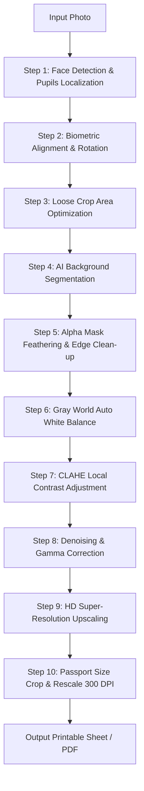

# 📷 AI Passport Photo Studio

> A professional, offline-capable AI-powered passport photo generator that produces **print-ready, biometrically compliant** photos for **34+ countries** — no cloud service required.

---

## ✨ Features

| Feature | Details |
|---|---|
| 🌍 **34+ Country Profiles** | USA, UK, India, Germany, UAE, Japan, China, Australia, and more |
| 🤖 **AI Face Detection** | MediaPipe or RetinaFace landmark-based alignment & auto-rotation |
| ✂️ **Smart Background Removal** | Powered by `rembg` (u2net, birefnet, and more) |
| 🎨 **Custom Backgrounds** | Replace background with any solid colour (white, off-white, blue, etc.) |
| 🖨️ **Printable Sheet Generator** | Auto-fill A4 / Letter / 4×6 / 5×7 sheets with cutting guides |
| 📄 **PDF Export** | One-click print-ready PDF output at 300 DPI |
| 🔬 **HD Super-Resolution** | Multi-step computational sharpening pipeline (+ optional Real-ESRGAN) |
| 🌈 **Image Enhancement** | Brightness, contrast, sharpness, saturation sliders with live preview |
| 📊 **Quality Assessment** | BRISQUE-inspired IQA score and auto-suggest enhancement values |
| 🖥️ **Dual UI** | Full-featured **Streamlit** app + REST **FastAPI** backend with HTML/JS frontend |

---

## 🚀 Quick Start

### Prerequisites

- **Python 3.9+**
- **pip**
- Windows, macOS, or Linux

### 1. Clone the repository

```bash
git clone <your-repo-url>
cd passport_size_maker
```

### 2. Create & activate a virtual environment

```bash
# Windows
python -m venv venv
venv\Scripts\activate

# macOS / Linux
python3 -m venv venv
source venv/bin/activate
```

### 3. Install dependencies

```bash
pip install -r requirements.txt
```

### 4. Configure environment

```bash
# Copy the example env file and edit as needed
copy .env.example .env   # Windows
cp .env.example .env     # macOS / Linux
```

### 5. Launch the application

**Windows — easiest way:**
```bat
run.bat
```
The launcher will ask which interface you want:
- `[1]` FastAPI + HTML/JS Web Studio *(recommended)*
- `[2]` Streamlit Web Studio
- `[3]` Run both simultaneously

**Manual launch:**
```bash
# FastAPI backend (http://127.0.0.1:8000)
python app.py

# Streamlit UI (http://localhost:8501)
streamlit run streamlit_app.py
```

---

## 🔄 The 10-Step Processing Pipeline

The core engine coordinates a structured image processing pipeline implemented in [pipeline.py](file:///d:/office%20project/passport_size_maker/models/pipeline.py):



1. **Face Detection & Pupil Landmark Extraction**: Uses **RetinaFace (ResNet-50)** to find face bounding boxes and pupil coordinates. Done via [align_and_detect](file:///d:/office%20project/passport_size_maker/models/face_detector.py#L153).
2. **Biometric Face Alignment & Leveling**: Rotates the image based on eye coordinates to ensure horizontal alignment of pupils.
3. **Auto Crop & Center (Loose Crop)**: Crops a loose box around the face, neck, and shoulders. This reduces the image footprint to optimize memory and speed for subsequent steps. Done via [loose_crop](file:///d:/office%20project/passport_size_maker/models/pipeline.py#L6).
4. **AI Background Removal**: Segments the subject using `rembg` (default model `isnet-general-use`).
5. **Alpha Mask Edge Refinement**: Performs soft thresholding and a Gaussian blur on the alpha channel to preserve hair semi-transparency and avoid jagged borders.
6. **OpenCV Color Correction & White Balance**: Applies a Gray World Auto White Balance (AWB) algorithm to eliminate color casts and normalize skin tones.
7. **Contrast Equalization (CLAHE)**: Runs Contrast Limited Adaptive Histogram Equalization on the L-channel of the LAB color space to equalize local lighting.
8. **Denoising & Gamma Correction**: Applies OpenCV Fast Non-Local Means Denoising to reduce noise, and adjusts midtones via gamma tables.
9. **HD Super-Resolution / Face Restoration**: Upscales the image 2x. Uses either the high-performance computational photography pipeline (Fast PIL HD) or the deep learning-based Real-ESRGAN x4plus model.
10. **Final Biometric Crop & Resize**: Performs the final country-spec crop and scales the image to the official dimensions (at 300 DPI) using Lanczos resampling.

---

## 🤖 Detailed AI Models Reference

The project loads models lazily and runs them locally. Model weights are stored in `gfpgan/weights/`:

*   **RetinaFace (ResNet-50 Backbone)**
    *   **Purpose**: Face detection and 5-point pupil landmark extraction.
    *   **File**: `detection_Resnet50_Final.pth` (~109 MB).
    *   **Module**: [face_detector.py](file:///d:/office%20project/passport_size_maker/models/face_detector.py).
*   **Background Removal Engine**
    *   **Purpose**: Subject-background segmentation.
    *   **Default Model**: `isnet-general-use` (~176 MB) - optimized for fine hair borders and portraits.
    *   **Fallback Models**: `u2net`, `u2netp` (4.7 MB).
    *   **Module**: [bg_removal.py](file:///d:/office%20project/passport_size_maker/models/bg_removal.py).
*   **Real-ESRGAN x4plus (Optional AI Upscaler)**
    *   **Purpose**: Generates high-frequency facial textures and cleans compression artifacts.
    *   **File**: `RealESRGAN_x4plus.pth` (~67 MB).
    *   **Module**: [super_resolution.py](file:///d:/office%20project/passport_size_maker/models/super_resolution.py).

---

## 📊 Strict Biometric & Image Quality Validation

The application coordinates a strict, 12-point quality validation check implemented in [auto_enhance.py](file:///d:/office%20project/passport_size_maker/models/auto_enhance.py#L209) that evaluates every uploaded and processed photo.

### 📋 Biometric Check Criteria

| Check Category | Target Specification | Criticality | Purpose |
| --- | --- | --- | --- |
| **Face Presence** | Face box detected by RetinaFace | Critical (FAIL) | Assure portrait subject is in frame |
| **Single Subject** | Exactly 1 face box detected | Critical (FAIL) | No multiple people in print |
| **Eyes Detected** | Map both pupils successfully | Critical (FAIL) | Ensure correct horizontal leveling |
| **Face Centering** | Horizontal center offset <= 10% | Warning (WARN) | Print layout centering compliance |
| **Pose & Rotation** | Head tilt roll angle <= limit (5°–10°) | Warning (WARN) | Prevent geometric perspective distortion |
| **Head Coverage** | Crown-to-chin height: 50%–69% of photo | Critical (FAIL) | Biometric cropping target validation (US default) |
| **Eye Level** | Eye line level: 56%–69% from bottom | Critical (FAIL) | Biometric eyeline height compliance (US default) |
| **Image Sharpness**| Laplacian variance >= 70.0 | Critical (FAIL) | Prevent blurry / out-of-focus prints |
| **Brightness (Dark)**| Mean luminance >= 90.0 | Critical (FAIL) | Avoid dark, underexposed portraits |
| **Brightness (Over)**| Mean luminance <= 220.0 | Critical (FAIL) | Avoid bright flash hotspots or overexposure |
| **Image Contrast** | Std dev of luminance >= 35.0 | Critical (FAIL) | Ensure background & face contrast |
| **Dimensions** | Exact specs matching country (e.g. 600x600 px) | Critical (FAIL) | Output resolution verification |

### 📈 Compliance Scoring Model
The system calculates a strict quality score out of 100 based on standard deductions:
*   Missing Face: `-40` points
*   Missing Eyes: `-20` points
*   Blur / Exposure / Contrast Failures: `-10` to `-15` points each
*   Tilt / Off-centering Warnings: `-5` points each
*   No Background Replacement: `-15` points

A photo **passes validation** (Validated PASS, score >= 90%) only if all critical biometric requirements are satisfied. If any check fails, detailed warning tags and corrective instructions are instantly rendered in both FastAPI and Streamlit frontends.

---

## ⚡ Performance Benchmarks & Execution Times

The following benchmarks were measured executing the pipeline stages on a standard **Intel CPU** host. 

> [!NOTE]
> Deep learning models (RetinaFace, rembg, and Real-ESRGAN) run on PyTorch/ONNX. Execution times are significantly faster (sub-second) when a CUDA-enabled GPU is available.

| Operation / Step | Execution Time (CPU) | Execution Time (GPU/Estimated) | Notes / Details |
| --- | --- | --- | --- |
| **Face Detection & Alignment** | `1.79s` | `< 0.2s` | RetinaFace ResNet-50 inference |
| **Background Removal** | `55.88s` | `< 1.5s` | Pymatting + rembg model |
| **Basic PIL Enhancement** | `0.02s` | `< 0.01s` | Sliders preview speed |
| **Advanced OpenCV Enhancement** | `1.60s` | `< 0.1s` | Denoising, AWB, CLAHE, Gamma |
| **Fast PIL HD Pipeline** | `1.01s` | `< 0.2s` | 4x Lanczos + multi-pass sharpening |
| **Real-ESRGAN AI Super-Resolution**| `~120s` | `< 0.5s` | Deep learning upscaler |
| **Passport Crop & Resize** | `0.04s` | `< 0.01s` | Biometric crop engine |
| **Layout Grid Generation** | `0.04s` | `< 0.01s` | Dynamic print sheet composer |
| **PDF Generation & Export** | `0.66s` | `< 0.1s` | ReportLab export |
| **Full Pipeline (Fast HD, No BG)** | `~4.5s` | `< 0.5s` | Face Detection + OpenCV Enhancements + Fast HD + Crop & Resize |
| **Full Pipeline (Fast HD + BG)** | `~60s` | `< 2s` | Entire pipeline with background removal |

---

## 🗂️ Project Structure

```
passport_size_maker/
├── app.py                   # FastAPI REST backend
├── streamlit_app.py         # Streamlit frontend UI
├── config.py                # Country rules, paper sizes, DPI settings
├── download_models.py       # Helper to download AI model weights
├── run.bat                  # Windows one-click launcher
├── requirements.txt         # Python dependencies
├── .env.example             # Environment variable template
│
├── models/                  # AI & image processing engines
│   ├── face_detector.py     # MediaPipe face detection & alignment
│   ├── bg_removal.py        # Background removal (rembg)
│   ├── crop_engine.py       # Biometric crop & resize to country spec
│   ├── enhancement.py       # Brightness / contrast / sharpness / saturation
│   ├── auto_enhance.py      # AI quality assessment & auto-suggest values
│   ├── super_resolution.py  # HD sharpening pipeline (+ optional Real-ESRGAN)
│   ├── layout_generator.py  # Printable sheet grid composition
│   ├── cutting_lines.py     # Professional crosshair cutting guides
│   └── pipeline.py          # End-to-end pipeline orchestration
│
├── utils/
│   └── pdf_generator.py     # ReportLab PDF export
│
├── static/                  # Frontend assets (CSS, JS, images)
├── templates/               # HTML Jinja2 templates
├── tests/                   # Unit tests
│
├── uploads/                 # (auto-created) Uploaded images
├── outputs/                 # (auto-created) Processed results
│   ├── passport/            # Single passport photo outputs
│   └── printable/           # Printable sheet + PDF outputs
│
└── gfpgan/
    └── weights/             # AI model weight files (not committed to git)
```

---

## 🌍 Supported Countries

<details>
<summary>Click to expand full country list (34 profiles)</summary>

| Region | Countries |
|---|---|
| **Americas** | 🇺🇸 United States, 🇨🇦 Canada |
| **Western Europe** | 🇬🇧 United Kingdom, 🇩🇪 Germany, 🇫🇷 France, 🇮🇹 Italy, 🇪🇸 Spain, 🇳🇱 Netherlands, 🇧🇪 Belgium, 🇨🇭 Switzerland, 🇦🇹 Austria, 🇵🇹 Portugal, 🇮🇪 Ireland |
| **Nordics** | 🇳🇴 Norway, 🇸🇪 Sweden, 🇩🇰 Denmark, 🇫🇮 Finland |
| **Eastern Europe** | 🇵🇱 Poland |
| **South Asia** | 🇮🇳 India |
| **East Asia** | 🇯🇵 Japan, 🇰🇷 South Korea, 🇨🇳 China |
| **Southeast Asia** | 🇸🇬 Singapore, 🇲🇾 Malaysia, 🇮🇩 Indonesia, 🇹🇭 Thailand |
| **Oceania** | 🇦🇺 Australia, 🇳🇿 New Zealand |
| **Middle East** | 🇦🇪 UAE, 🇸🇦 Saudi Arabia, 🇶🇦 Qatar, 🇰🇼 Kuwait, 🇴🇲 Oman |

Each country profile includes: photo dimensions (mm & px), head height ratio, eye-line position, required background colour, expression & glasses rules.

</details>

---

## 🖨️ Supported Print Paper Sizes

| Paper Size | Dimensions |
|---|---|
| 4 × 6 inches | Standard photo paper |
| 5 × 7 inches | Larger photo paper |
| A4 Standard | 210 × 297 mm |
| Letter Standard | 8.5 × 11 inches |
| Legal Standard | 8.5 × 14 inches |

---

## 🔌 REST API Reference

Base URL: `http://127.0.0.1:8000`

> A full Postman collection is included: [`passport_size_maker.postman_collection.json`](passport_size_maker.postman_collection.json)

### System Info

| Method | Endpoint | Description |
|---|---|---|
| `GET` | `/api/countries` | List all supported country rules |
| `GET` | `/api/paper-sizes` | List all supported paper sizes |

### Core Pipeline (3 steps)

#### Step 1 — Upload Photo
```http
POST /api/upload
Content-Type: multipart/form-data

file: <image file>   # JPG, PNG, HEIC supported
```
Returns: `{ filename, face_coords, eye_coords, aligned_image_url }`

#### Step 2 — Process Passport Photo
```http
POST /api/process
Content-Type: application/json

{
  "filename": "your_uploaded_file.jpg",
  "country": "usa",
  "face": { "x": 250, "y": 180, "w": 300, "h": 350 },
  "scale": 1.0,
  "x_offset": 0,
  "y_offset": 0,
  "manual_rotation": 0.0,
  "remove_bg": false,
  "bg_color_hex": "#FFFFFF",
  "brightness": 1.0,
  "contrast": 1.0,
  "sharpness": 1.0,
  "saturation": 1.0
}
```
Returns: `{ passport_filename, passport_url }`

#### Step 3 — Generate Printable Sheet
```http
POST /api/generate-sheet
Content-Type: application/json

{
  "filename": "passport_your_file.png",
  "country": "usa",
  "paper_size": "A4",
  "margin_mm": 8.0,
  "gap_mm": 2.5
}
```
Returns: `{ sheet_url, pdf_url, photo_count }`

---

## ⚙️ Environment Variables

Copy [`.env.example`](.env.example) → `.env` and adjust:

| Variable | Default | Description |
|---|---|---|
| `HOST` | `127.0.0.1` | FastAPI server host |
| `PORT` | `8000` | FastAPI server port |
| `RELOAD` | `True` | Hot-reload on code changes |
| `UPLOAD_FOLDER` | `uploads` | Incoming image storage path |
| `OUTPUT_FOLDER` | `outputs` | Processed output base path |
| `PASSPORT_OUTPUT_FOLDER` | `outputs/passport` | Single photo output path |
| `PRINTABLE_OUTPUT_FOLDER` | `outputs/printable` | Sheet & PDF output path |
| `DPI` | `300` | Print resolution |
| `DEFAULT_MARGIN_MM` | `8.0` | Sheet edge margin in mm |
| `DEFAULT_GAP_MM` | `2.5` | Gap between photos in mm |
| `REMBG_MODEL` | `u2net_human_seg` | Background removal model |

### Available `REMBG_MODEL` options

| Model | Size | Notes |
|---|---|---|
| `u2net_human_seg` | 176 MB | ✅ Recommended — fast & accurate |
| `u2net` | 176 MB | General purpose |
| `u2netp` | 4.7 MB | Ultra-lightweight |
| `birefnet-general` | 973 MB | Highest quality |
| `birefnet-portrait` | 300 MB | Optimised for faces |

---

## 🧪 Running Tests

```bash
pytest tests/ -v
```

---

## 📦 Optional: HD Super-Resolution (Real-ESRGAN)

Real-ESRGAN is an **optional** AI model for higher quality upscaling. Install manually if needed:

```bash
pip install realesrgan basicsr
```

Then download the model weights:
```bash
python download_models.py
```

Weights are saved to `gfpgan/weights/` (excluded from git).

---

## 🛠️ Tech Stack

| Layer | Technology |
|---|---|
| **Backend API** | FastAPI + Uvicorn |
| **Frontend UI** | Streamlit / HTML + CSS + JS |
| **Image Processing** | Pillow, OpenCV (cv2), NumPy |
| **Face Detection** | MediaPipe / RetinaFace |
| **Background Removal** | rembg (ONNX Runtime) |
| **AI Enhancement** | PyTorch, TorchVision, ONNX Runtime |
| **PDF Export** | ReportLab |
| **Configuration** | python-dotenv, Pydantic |

---

## 📄 License

This project is for personal and internal office use. Please ensure compliance with the terms of any third-party AI model weights used (rembg, MediaPipe, Real-ESRGAN).

---

<p align="center">Built with ❤️ for producing professional passport photos without cloud dependency.</p>
